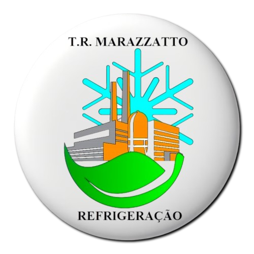

##  T.R. MARAZZATTO DASHBOARD

🇺🇸 Automated program for creating panels, in order to present the performance of PMOC and other Services, from the company T.R. MARAZZATTO to industries such as Unilever and others.

🇧🇷 Programa automatizado para criação de painéis, com o objetivo de apresentar o desempenho do PMOC e outros Serviços, da empresa T.R. MARAZZATTO para indústrias como a Unilever e outras.


#### [License: Apache License Version 2.0 or later](https://www.apache.org/licenses/)

<br/>

#### ```Author: Gustavo Madureira ( gtmadureira@gmail.com )```

<br/>

### ⚠️ ___FOR INTERNAL PURPOSES ONLY___ ⚠️

<br/>

## Dependencies

### [Python 3.12](https://www.python.org/downloads/) or higher
### [Git 2.43](https://git-scm.com/downloads) or higher

[?????? Module](https://pypi.org/project/??????/):

    pip install ??????

<br/>

### Minimum [RAM requirements](#memory-consumption)

<br/>

## Installation

    git clone https://github.com/gtmadureira/trm-dashboard.git trm-dashboard

<br/>

## Quick Start

#### For macOS/Linux operating system

    python3 -OO dashboard.py

#### For Windows operating system

    python -OO dashboard.py

<br/>

## How It Works

?????????????????????

<br/>

## Expected Output

?????????????????????


<br/>

## Memory Consumption

The memory consumption stack trace was made by using [mprof](https://pypi.org/project/memory-profiler/) to monitor this program.
